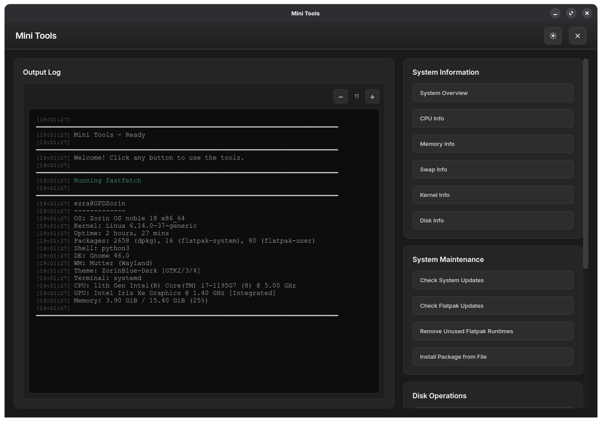

# MiniTools

A small but modern looking GUI application for Linux system information and maintenance, built with PyQt6.

## Features

- **System Information**: Display CPU, memory, kernel, swap, and disk information
- **System Maintenance**: Check for system updates and Flatpak updates
- **Disk Operations**: Change partition UUID
- **Extensions**: Support for custom shell (`.sh`) and Python (`.py`) scripts
- **Modern UI**: Clean, responsive interface with dark/light theme support
- **Customizable**: Adjustable font size for the output log



## Requirements

- Python 3.6+
- PyQt6

## Installation

1. Clone the repository:
```bash
git clone <repository-url>
cd MiniTools
```

2. Install dependencies:
```bash
pip install PyQt6
```

3. Run the application:
```bash
python3 MiniTools.py
```

## Usage

Click any button in the interface to use the corresponding tool. The output will be displayed in the log panel.

### Adding Extensions

Place your custom scripts (`.sh` or `.py`) in `~/.config/hotodogo/minitools/extensions/`. They will automatically appear in the Extensions section.

## License

GNU General Public License v3.0 (GPL-3.0)
